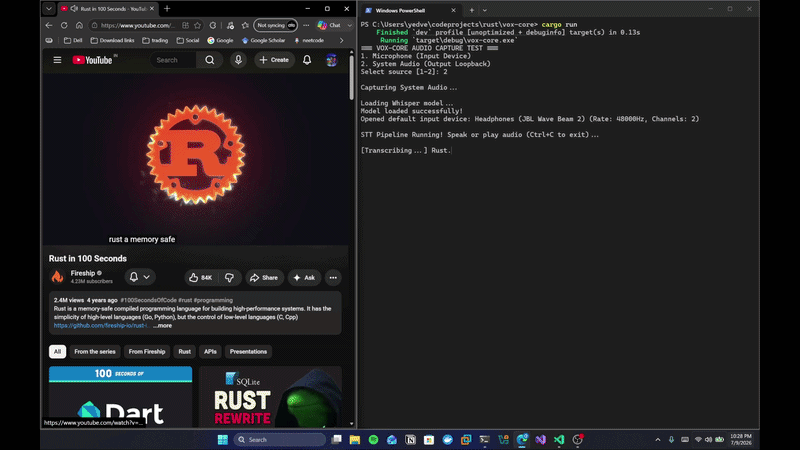

# vox-core

vox-core is a lightweight, high-performance offline speech-to-text pipeline written in Rust. It captures audio from either a microphone or the system loopback, runs real-time digital signal processing (DSP) filters, and transcribes the audio stream locally using Whisper.


## Demo

<p align="center">
  
</p>

## Technical Specifications

- Language: Rust (Edition 2024)
- Threading: Multi-threaded pipeline using a lock-free Single Producer Single Consumer (SPSC) ring buffer to pass audio safely from the audio callback thread to the processing/transcription thread
- Sample Format: 32-bit floating-point mono PCM at 16kHz (as required by Whisper)
- Core Dependencies:
  - `cpal`: Handles cross-platform audio device querying and input capture (WASAPI on Windows)
  - `ringbuf`: Lock-free ring buffer for thread synchronization
  - `whisper-rs`: Rust bindings to native C++ `whisper.cpp`

## Digital Signal Processing (DSP) Filters

All raw audio samples undergo a three-stage real-time DSP pipeline:
1. **High-Pass Filter**: A 1-pole high-pass filter ($y[n] = x[n] - 0.95 \times x[n-1]$) to eliminate low-frequency background hum and room rumble (cutoff frequency approx. 130Hz at 16kHz).
2. **Resampler**: A stateful linear interpolating resampler that downsamples arbitrary input sample rates (e.g., 44.1kHz, 48kHz) to exactly 16kHz.
3. **Noise Gate**: A sample-by-sample envelope follower with customizable attack (~10ms) and release (~150ms) times that gates (silences to 0.0) any signals below a set threshold.

## Models Required

- Whisper Model: A model file in GGML format is required.
- Default path: `models/ggml-tiny.en.bin`
- Source: [ggerganov/whisper.cpp (HuggingFace)](https://huggingface.co/ggerganov/whisper.cpp/resolve/main/ggml-tiny.en.bin)

## CLI Interface & Processing Loop

At startup, the CLI provides an interactive audio source selection menu:
1. **Microphone**: Captures the default input recording endpoint.
2. **System Audio**: Captures the default output device playback stream (via WASAPI loopback).

### Processing Logic
- **Hallucination Cleaning**: Commonly generated silence hallucinations (e.g. `[BLANK_AUDIO]`, `(music)`, `Thank you.`) are stripped out.
- **Live Display**: The active, uncommitted audio segment is transcribed and updated inline. The terminal output is truncated to the last 60 characters to prevent line wrapping and screen duplication.
- **Length-Based Committing**: Text is formatted into lines of 50 characters. Once the text reaches 5 lines (250 characters) OR a 1.2-second pause is detected:
  - The block is printed as `[Final]`.
  - The accumulator is cleared, retaining a 1.5-second audio overlap window to preserve transcription context for the next block.

## Running Instructions

### Setup Model
Download the GGML model in the `models/` directory :
```bash
mkdir models
# Download the model and place it as `models/ggml-tiny.en.bin`
```

### Windows (PowerShell)
To bypass LLVM/Clang requirements during building, set the `WHISPER_DONT_GENERATE_BINDINGS` environment variable before running:
```powershell
$env:WHISPER_DONT_GENERATE_BINDINGS="1"
cargo run
```

### macOS & Linux
```bash
export WHISPER_DONT_GENERATE_BINDINGS=1
cargo run
```
